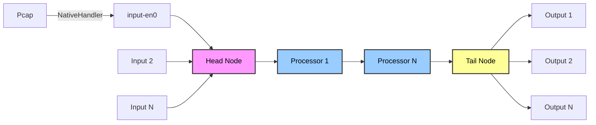

```mermaid
graph LR
    PCAP[Pcap] -->|NativeHandler| I1
    I1[input-en0] --> H
    I2[Input 2] --> H
    I3[Input N] --> H
    H[Head Node] --> P1
    P1[Processor 1] --> P2
    P2[Processor N] --> T
    T[Tail Node] --> O1[Output 1]
    T --> O2[Output 2]
    T --> O3[Output N]

    style H fill:#f9f,stroke:#333,stroke-width:2px,color:#000
    style T fill:#ff9,stroke:#333,stroke-width:2px,color:#000
    style P1 fill:#9cf,stroke:#333,stroke-width:2px,color:#000
    style P2 fill:#9cf,stroke:#333,stroke-width:2px,color:#000
```